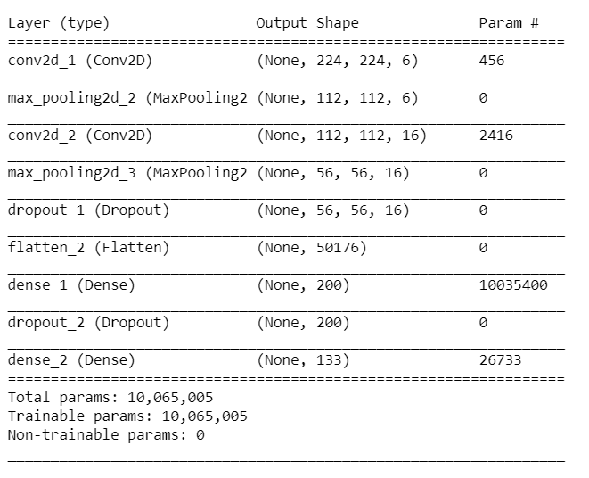
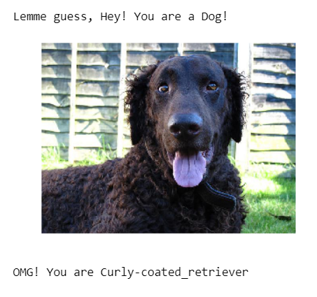
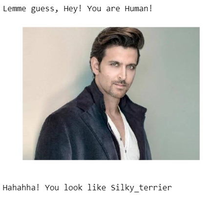
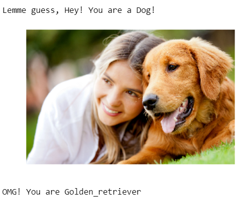

# Dog-Breed-Classifier-using-CNN

## Introduction
This repo contains a Dog breed classifier algorithm using deep learning. The main functions of this algorithm are:
- If a dog is detected in the image, it will provide an estimate of the dog's breed. 
- If a human is detected, it will provide an estimate of the dog breed that is most resembling.

## Medium Post link
[Dog Breed classifier using CNN](https://medium.com/@mrinalgupta1704/dog-breed-classifier-using-convolutional-neural-networks-6052edfab487?source=friends_link&sk=39520c87c22a581ee5d50306b43c667c)

## Motivation
This project is one of the most popular deep learning projects from the Udacity's Data Science Nanodegree program. I decided to go with this project in order to expose myself to the world of Convolutional Neural Networks. It is the final project for my Nanodegree before it gets completed.

## Libraries used
- Keras
- sklearn
- pandas
- numpy
- cv2
- PIL

## Instructions
- Download the [Dog Dataset](https://s3-us-west-1.amazonaws.com/udacity-aind/dog-project/dogImages.zip). Unzip the folder and place it in the repo, at location path/to/dog-project/dogImages. The dogImages/ folder should contain 133 folders, each corresponding to a different dog breed.
- Download the [human dataset](http://vis-www.cs.umass.edu/lfw/lfw.tgz). Unzip the folder and place it in the repo, at location path/to/dog-project/lfw. If you are using a Windows machine, you are encouraged to use 7zip to extract the folder.
- Run the file called 'dog_app.ipynb'

## Steps Followed
- Import the Dataset
- Detect Humans using CV2
- Detect Dogs
- Create a CNN to classify Dog Breeds (from Scratch)
- Use a CNN to Classify Dog Breeds (using Transfer Learning)
- Create a CNN to Classify Dog Breeds (using Transfer Learning)
- Write the Algorithm
- Test the Algorithm

## Model Architecture
1) My architecture contains Two Convolutional layers to extract the features from the images.
2) The first convolutional layer is made up of 6 filters of size 5x5 with ReLu as the activation function as it solves the problem of vanishing gradient that we face in Sigmoid. Similarly, in the second Convolutional layer we have 16 filters of same size and same activation function.
3) In order to reduce the number of parameters and extract only the most important features, two Max Pooling layers of size 2x2 are added after each Convolutional layer.
4) Further, a Dropout layer with a probability of 0.2 is added in order to prevent overfitting.
5) Towards the end, we have a fully connected layer with 200 input number of nodes and ReLu activation function.
6) Another dropout layer of 0.4 is added to speed up the process and prevent overfitting.
7) Finally, we have the output layer with the number of nodes equal to the number of dog breeds that we have in the dataset with softmax activation function to predict the probababilities of the diffefrent breeds.

  

# Results

  

  

  

  

